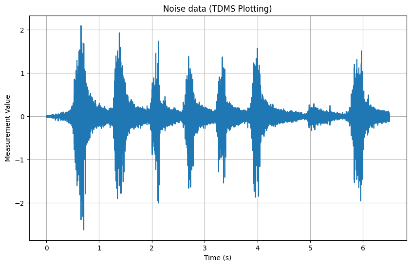
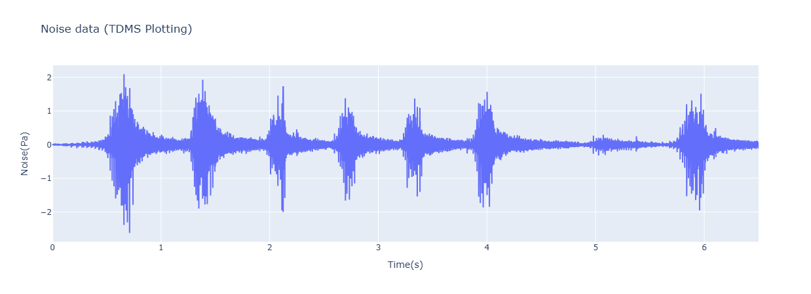

# Coding things I learned while working at Emerson
 **By Cragun Scott**

This is just a few things I learned from Ray and other on the job stuff. 

## VSCode Shortcuts
---
 <!----------- VSCode Shortcuts  -------------->
- This is a list of useful VSCode Shortcuts I thought were useful
### Commands
| Command | Description | 
| ------------------------- | --------------- | 
| [Ctrl + /] 				| Comment out line |
| [Shift + Alt + Up/Down] 	|Duplicate Current Line  |
| [Ctrl + Shift + K] 		| Delete the Line  |
| [Ctrl + Alt + Up/Down key] | Multiple Cursors  |
| [Ctrl + D] 				| Select the current word  |
| [Ctrl + L] 				| Select Current line |
| [Alt + up/down] 			| Move line up or down |
| ------------------------- | --------------- | 
| [Ctrl + Pg Up/down] 		| Switch Tabs |
| [Ctrl + \\] 				| Split Editor |
| [Ctrl + Shift + V] 		| Preview Markdown  |
| [Ctrl + Shift + F] 		| Format Document  |
| ------------------------- | --------------- | 
| [Ctrl + `(backtick)] 		| Toggle Terminal |
| [Ctrl + B] 				| Toggle Sidebar  |
| [Ctrl + Shift + P] 		| Command Palette |
| [Ctrl + Shift + F] 		| Search all Files |
| F2 						| Rename Component |
|  |  |  |  |

### Special Characters in document search [Ctrl + f]

## GIT
### Stash
- `git stash` allows you to stash or hide any changes you made and gives you a clean working tree.
- `git stash list` shows all of your previous stashes and the branch they are on.
  - a stash id, similar to `stash@{1}` is given for each stash
- to unstash or reapply your stashed changes you can run:
  - `git stash pop <stash_id>` to apply the changes and remove the stash
  - `git stash apply <stash_id>` to apply the changes and keep the stash
  - ***Note:****you do not need to use `stash_id` if you are working with your most recent stash*

## Merge Conflict
A merge conflict can happen either during a `git pull` or a `git merge`. Merge conflicts happen when lines in a file have been changed on your machine and on the file in the cloud. when you get a merge conflict error, do the following:
1. run a `git status` and see what files were not able to be merged (typically listed in red)
2. open each file or use `git diff` and look for the Merge conflict headers`<<<<<<Head`, `=======`, `>>>>>><Branch_Name>`
	- Git 'physically' edits the file to add these in it. To completely resolve the merge conflict, these headers need to be removed
3. Inspect the conflicting code and determine what needs to be kept and what needs to be removed
4. Remove the headers and all lines or parts of the code the do not belong.
5. Mark the merge conflicted file(s) as resolved by running `git add <filename>`
6. Finish the merge by running `git commit`

## Python
---
 <!-----------   Python    -------------->

### FlexLogger API
Documentation for the API can be found at: https://niflexlogger-automation.readthedocs.io/en/latest/api_reference.html.

The NI FlexLogger Automation API is primarily designed to: Control FlexLogger while its running, Read current channel values from FlexLogger, and Receive events and status updates from FlexLogger. It is not intended as a data streaming API for actively logged data. 

imports:
`from flexlogger.automation import Application`

| function usage | what it does |
| --- | --- |
| ___Project and app___ | | 
| `from flexlogger.automation import Application` | Imports the app api |
| `project = Application.get_active_project()` | Saves the current project object(for active projects) |
| `project = Application.open_project(path=project_path, timeout=180)` | opens and sames the current project object |
| ___channel_specification___| |
| `project.open_channel_specification_document()` | | 
| `channel_specification.set_channel_value(Channel_name, Set_value)` | used for setting output channel values |
| `channel_specification.get_channel_value(channel_name)` | gets the current channel value and date time info:  |  
| ___test_session___ | |
| `project.test_session` | accesses and saves the test session object/file | 
| `test_session.start()` | Runs the data logging |
| `test_session.stop()` | Stops the data logging |
| `test_session.state` | Shows the logging state of the test|
| ___logging_specification___ ||
| `project.open_logging_specification_document()` | Accesses the logging spec document | 
| `logging_specification.get_log_file_base_path()` | gets the path to where the logging data file is stored | 
| `logging_specification.get_log_file_name()` | gets the logging file name (shows the name variables) | 
| `` | | 
| `` | | 
| `` | | 
| `` | | 
| `` | | 
| `` | | 
| `` | | 
| `` | | 
| `` | | 
| `` | | 


Code to launch and interface with FlexLogger:
```python
def FlexLogger_launcher(Function_to_execute, <args>):
    """Connects to FlexLogger or Opens FlexLogger if it is closed, and runs a specified test or function. 
    Following the function run, this function will disconnect from FlexLogger and leave it in the state it was found in (opened or closed).

    Args
        Function_to_execute: (function) The predefined test or function that will be ran after FlexLogger is connected to and running. 
    """

    isOpen = False
    # Check if FlexLogger is open, then run test
    app = None
    try:    # Check to see if FlexLogger is open
        app = Application()
        print("Checking if FlexLogger is open...", end="")
        
    except: # if FlexLogger is not open
        print("\tFlexLogger is not open")
        print("Launching FlexLogger...")

        # Launch FlexLogger and open a project.
        with Application.launch() as app:
            # print version
            versions = app.get_version()
            print(f"\tFlexLogger version: {versions[1]}")

            # open project
            project_path = "C:/Users/....../Logger.flxproj"
            project = app.open_project(path=project_path, timeout=180)

            Function_to_execute(<args>)   # Run the proscribed test

            project.close()

    else:   # if FlexLogger is open
        project = app.get_active_project()
        print("\tFlexLogger is it open.")
        isOpen = True
        Function_to_execute(<args>)   # Run the proscribed test
        channel = project.open_channel_specification_document()
        app.disconnect()        

    return 0
```

### DIAdem Scrip 
Documentation for DIAdem's scripting can be found at: https://www.ni.com/docs/en-US/bundle/diadem/page/readme/readme/programming_references_overview.htm.

DIAdem's Indexing starts at 1, not 0

Accessing data
| Object/Attribute/Function | Description/List | |
| -- | -- | -- |
| `dd.Data.Root.ChannelGroups(<int or "Name">)` |  allow you to access the Channel Group information.|  |
| `<Channel Group.Channels>(<int or "Name">)` |  allow you to access the Channel information.| |
| `<Channel>.Size` | returns the size of the channel (or channel group?) | |
| `<Channel Group>.Channels.Count` | Gives the number of channels in a channel group | |
| `<Channel Group or Channel>.Properties.Count` | Gives the number of properties in a channel group or channel | |
| `len(<Channel Group or Channel>)` |  gets the number of channels in the group or the length of the data array|| 
| `<Channel Group>.Activate()` |  Makes that group the active group.| |
| `<Channel Group or Channel>.Name` | Give the name of the channel or group| |
| `<Channel Group or Channel>.Exists(<"Name">)` |  Returns a bool of if a channel with that name (or number), exists.| |
| `<Channel Group or Channel>.Properties` |  allow you to access the Channel Group's properties. Some useful properties are:| |
|  | `Length` |  - Used to trim or expand the channel size| 
|  | `implicit_start` |  - used for time and waveform channels to set when their relitive time starts. (in units of the time channel)| 
|  | `unit_string` | returns the units of the channel |
| `<Channel Group or Channel>.Properties(<"Property Name">).Value` |  allow you to access and modify a specific Channel Property's value.| 
|  | `DataTypeChnFloat64` | 64-bit real values | 
|  | `DataTypeChnString` |  Text | 
|  | `DataTypeChnDate` |    Time values | 
| |  Note: you cant create a Waveform channel this way, you need to use another method |
| `<channel>[index]` | Returns the value at that index | |
| | | |

Manipulating data
| Object/Attribute/Function | Description/List | |
| -- | -- | -- |
| `<Channel Group>.Add(<"Name">,<Location number>)` |  creates a new channel group at located in the channel position | |
| `<Channel Group.Channels>.Add(<"Name">,<data type>)` |  allows you to create a new channel in that group with the following data types:| |
| `dd.Data.Move(<Channel to move>,<Destination Channel Group>,<Position Number in group>,True)` |  allows you to move a channel's position or to a new group. | |
| `<Channel>.GetValuesBlock(data_start, data_span)` |  allows you to copy the data in a channel starting at the `data_start`  index | |
| `<Channel>.SetValuesBlock(<List of Values>, <Index location>, <Save type>)` |  allows you to save a list of values to a channel's data. The Save type options are:  | |
  | `dd.eValueBlockValueOverwrite` |  writes over any data that over laps with the inserted data | |
  | `dd.eValueBlockValueInsert` |  inserts the data and pushed any existing data over | |
| `dd.ChnConvertNumericToWaveform(<Time Channel>,<Numerical Channel>, False, "WfXRelative")` |  converts a Numeric channel into a waveform channel based on the sample rate in the time  channel | |
| `dd.Data.Remove(<channel_to_delete>)` | deletes a channel. can delete on channel or a list of channels. to create a list of channels use `Var = dd.data.CreateElementList()` to create the list and `Var.Add(<channel>)` to add to it| |
| | | |
| | | |
TODO: Add more items to the table (for view and other analysis stuff)

The Beginning of a DIAdem Script always starts with:
``` python
# --------------------------------------------------------------------
# -- Python Script File
# -- Created on <date> <time>
# -- Author: <username>
# -- Comment: <comments>
# --------------------------------------------------------------------
import sys
if 'DIAdem' in sys.modules:
    from DIAdem import Application as dd

    if dd.AppEnableScriptDebugger:
        import debugpy
        debugpy.configure(python = sys.prefix + '\\python.exe')
        if not debugpy.is_client_connected():
            try:
                debugpy.listen(5678)
            except:
                pass
            debugpy.wait_for_client()

# --------------------------------------------------------------------
# -- Beginning of user code --
```

#### "If Main"
DIAdem is the name of the main script ran in DIAdem. So in order to have part of a DIAdem script run if it is the main script (not imported) the following code must be before that code section:
```python
if __name__ == "DIAdem":
    # Code to be executed
    # Goes here.
```

#### Function to load date
The following is a function that will open a window for the user to select data
```python
def select_data(path=dd.CurrentScriptPath):
	'''
	Allows the user to select what data to use. 
	The user can select multiple TDM/TDMS type files to combine them into one data set. 
	After file selection, the test Information group will be deleted and the log file will be renamed.
	Finally the data will be renamed based on the last log file's property information.
	
	returns: 
		True: data loaded successful 
		False: load error
	'''
	# Message box for loading new data
	load_data = dd.MsgBoxDisp("Would you like to load new data your data?","MB_YESNO") 
	if load_data == "IDYes" : 
		# add a save data prompt
	
		dd.DlgState = dd.FileDlgShow(path,"*.tdm*", "File Selection", True)
		if dd.DlgState=="IDOk":
			dd.Data.Root.Clear()
			for sElem in dd.FileDlgNameList:
				dd.DataFileLoad(sElem,"","")
			return True

		else:
			dd.MsgBoxDisp("Data loading has been aborted")
			return False
	#if no
	else: 
		dd.MsgBoxDisp("Keeping your current data set", "MB_OK", "MsgTypeInformation",None , 2)
		return True
```

#### View file code

| Object/Attribute/Function | Description/List | |
| -- | -- | -- |
| dd.View.NewLayout()  | clears the current views |   |
| dd.View.ActiveSheet.ActiveArea.DisplayObj | Allows you to set the chart type | Options:"CurveChart2D"  |
| dd.View.ActiveSheet.ActiveArea.DisplayObjType | Allow you to save the table as a variable |   |
| dd.View.Sheets.Add(sheet_name)  | adds a new view sheet |  |
| cur_chart.Curves2D.Add(<x_channel>,<y_channel>)  | adds a curve to the chart |  |
| dd.View.ActiveSheet | accesses the current sheet |  |
|  |  |  |

Function that makes a new view file of a plot of 2 channel with their own axies
``` python
def View_create():
    # Create New layout and chart
    dd.View.NewLayout()
    
    dd.View.ActiveSheet.ActiveArea.DisplayObjType = "CurveChart2D" 
    cur_chart = dd.View.ActiveSheet.ActiveArea.DisplayObj 
    cur_chart.YScaling = "n axes [phys.]" 
    cur_chart.UseCurveRelatedYScaling = True 
    
    # Create different Scales
    scale_list = dd.view.ActiveSheet.ActiveArea.DisplayObj.YScalingList 
    scale_list.Add("name1","title1 (unit1)")
    scale_list.Add("name2","title2 (unit2)")

    # Set Scale limits
    scale_list(1).Mode = dd.eVIEWYScalingModeAutomatic
    scale_list(2).Mode = dd.eVIEWYScalingModeManual 
    scale_list(2).Begin = 5 
    scale_list(2).End = 50

    # Add Curves to the View
    cur_chart.Curves2D.Add(0,f"[1]/[2]") 
    cur_chart.Curves2D.Add(0,f"group_name/channel_name") 
    
    # Assign curves to a scale
    cur_chart.Curves2D(1).CurveRelatedYScalingName = "name1" 
    cur_chart.Curves2D(2).CurveRelatedYScalingName = "name2" 
    
    #Assign Curves a color
    cur_chart.Curves2D(1).Color = "red" 
    cur_chart.Curves2D(2).Color = "blue" 
    
    # Removes the units from the legend
    cur_chart.LegendItems.Remove("unit_string")
```

### npTDMS: TDMS Python Learning file 
Taken from: [npTDMS’s documentation](https://nptdms.readthedocs.io/en/stable/index.html)
- The documentation explains that, while the TDMs reading capability of npTDMS works great, it's writing capability is lacking. 

The TDMs test file contains selected parts take from the NI DIAdem example file. The file can be found here: [Test.tdms](Test.tdms) (Warning: TDMs is a binary fine type.)
TDMS files allow reading data while it is actively being logged.

#### Data viewing
1) Load the Test.tdms file
2) Print out the channels and groups that are in the file.
3) Print properties from the file, the noise data group, and noise_4 channel

``` python
from nptdms import TdmsFile

tdms_file = TdmsFile.read("test.tdms")  # Note: TdmsFile.read loads the whole file at once. use TdmsFile.Open() when working with big files

# Print out the data groups and channels
for group in tdms_file.groups():
    print(group.name)
    for channel in group.channels():
        print(f"  - {channel.name}")
```

``` python
# Prints out the file properties
print("file level ------------")
for p in tdms_file.properties.items():
    print(f"  {p[0]}:\t{p[1]}")

# Prints out the Noise Data properties
print("\nNoise Data Group ---------")
for p in tdms_file["Noise data"].properties.items():
    print(f"  {p[0]}:\t{p[1]}")

# Prints out the Noise Data properties
print("\nNoise Data  ---------")
for p in tdms_file["Noise data"]["Noise"].properties.items():
    print(f"  {p[0]}:\t{p[1]}")
```

### Creating View files

#### Plot Data
1) Prep the noise data to be time based
2) Plot it in Matplotlib
3) Plot the Noise data

``` python
import matplotlib.pyplot as plt

# Prep the noise 4 data for plotting
noise_chan = tdms_file["Noise data"]["Noise"]
noise_data = noise_chan.data
data_time = noise_chan.time_track(absolute_time=False)

# Create the Matplotlib plot
plt.figure(figsize=(10, 6))
plt.plot(data_time, noise_data)
plt.xlabel('Time (s)')
plt.ylabel('Measurement Value')
plt.title('Noise data (TDMS Plotting)')
plt.grid(True)

# Show the noise4 data plot 
plt.show()
```
Results:
[](images/npTDMS_noise_MPL_plot.png)

#### Editing the TDMs File
1) Trimming channel data
2) Editing channel properties
3) Creating new groups
4) Saving new channels
5) Moving channels to different groups

```python
# TODO: Learn how to edit TDMS files in python
```

### Plotly
Plotly is a library that enables interactive graphs using JavaScript and your web browser.

The following plot was made using the test.tmds data used in the npTDMS overview.

``` python
import plotly.graph_objs as go

# load the data into the plot
fig = go.Figure(data=go.Line(
    x=data_time, 
    y=noise_data,
    mode='lines'
))

fig.update_layout(
    title="Noise 4 data (TDMS Plotting)",
    xaxis_title='Time(s)',
    yaxis_title='Noise(Pa)'
)  

# Show the Noise4 data
fig.show()
```
Results:
[](images/npTDMS_noise_MPL_plot.png)


### Scipy


### Statistics in Python
#### Statistics (built in Python)
Doc: https://docs.python.org/3/library/statistics.html


#### Statsmodels 
Doc: https://www.statsmodels.org

Ref: https://machinelearningmastery.com/time-series-forecasting-methods-in-python-cheat-sheet/
